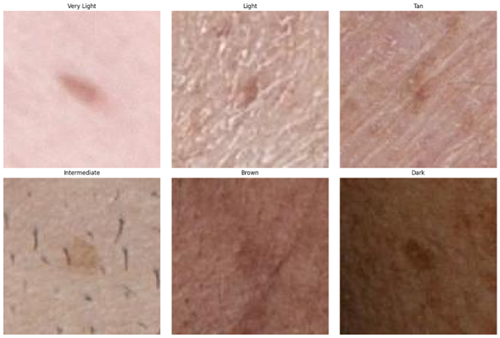

# Skin Lesion Classification with EfficientNet

Deep learning pipeline for **malignant vs benign skin lesion classification** using clinical images from the **ISIC SLICE-3D dataset**.

The project trains an **EfficientNet-B0 convolutional neural network** using PyTorch to identify malignant skin lesions from smartphone-like clinical images.

This work explores how deep learning models can assist in **early skin cancer triage**, especially in regions without access to dermatology specialists.

---

# Problem

Skin cancer can be deadly if not detected early. While dermoscopy-based AI systems have shown strong performance, these systems typically rely on high-quality dermoscopic images taken in clinical settings.

However, many patients first encounter healthcare through **primary care or telehealth**, where only lower-quality images are available.

This project investigates whether deep learning models can classify skin lesions using **non-dermoscopic images extracted from 3D total body photography (TBP)**.

The goal is to predict:

```
P(malignant | lesion image)
```

---

# Dataset

Dataset used:

**ISIC SLICE-3D Skin Lesion Dataset**

The dataset includes:

- thousands of patients
- images extracted from **3D Total Body Photography**
- lesions cropped into **15×15 mm fields of view**
- clinical metadata for each lesion

Images are stored in:

```
train-image.hdf5
```

Metadata is stored in:

```
train-metadata.csv
```

Each lesion has a binary label:

```
0 → benign
1 → malignant
```

---

# Model Architecture

The model uses **EfficientNet-B0**, a convolutional neural network pretrained on ImageNet.

Transfer learning strategy:

- freeze early convolutional layers
- fine-tune deeper feature layers
- replace classifier with a **binary output layer**

Architecture overview:

```
EfficientNet-B0
      ↓
Feature extraction layers
      ↓
Fine-tuned convolution blocks
      ↓
Fully connected classifier
      ↓
Malignant vs Benign
```

---

# Data Preprocessing

Images are resized and normalized before training.

```python
transforms.Resize((224,224))
transforms.ToTensor()
transforms.Normalize(
    mean=[0.485,0.456,0.406],
    std=[0.229,0.224,0.225]
)
```

Images are loaded directly from the **HDF5 dataset** using `h5py`.

---

# Handling Class Imbalance

The dataset contains many more benign lesions than malignant ones.

To address this imbalance:

### 1️⃣ Controlled sampling

Benign lesions are sampled at **4× the malignant count**.

### 2️⃣ Data augmentation

Malignant images are augmented using:

- horizontal flips
- vertical flips
- rotation

This increases representation of malignant cases during training.

---

# Skin Tone Analysis

The project also analyzes model predictions across **different skin tone categories**.

Skin tone is estimated using the **Individual Typology Angle (ITA)** derived from LAB color space:

```
ITA = arctan((L* − 50) / B*) × (180 / π)
```

Categories:

| Skin Tone | ITA Range |
|-----------|-----------|
| Very Light | > 55 |
| Light | 41 – 55 |
| Intermediate | 28 – 41 |
| Tan | 10 – 28 |
| Brown | −30 – 10 |
| Dark | < −30 |

Example categories from the dataset:



This enables analysis of **model performance across different skin tones**, an important aspect of fairness in medical AI.

---

# Training Details

Training configuration:

| Parameter | Value |
|----------|------|
| Framework | PyTorch |
| Model | EfficientNet-B0 |
| Batch Size | 32 |
| Optimizer | AdamW |
| Loss Function | CrossEntropyLoss |
| Epochs | 10 |

The best model is saved as:

```
skin_lesion_model_best.pth
```

---

# Results

Example training performance:

| Metric | Value |
|------|------|
| Training Accuracy | ~97% |
| Test Accuracy | ~91% |

The model successfully learns discriminative patterns between malignant and benign lesions.

---

# Output

Model predictions are exported to:

```
learner_results.csv
```

This file contains:

- prediction correctness
- patient demographics
- estimated skin tone
- lesion metadata

This allows further analysis of model performance across demographic groups.

---

# Technologies Used

- Python
- PyTorch
- EfficientNet
- NumPy
- Pandas
- HDF5
- Matplotlib
- PIL

---

# Project Presentation

Slides explaining the methodology and results:

Google Slides:

```
https://docs.google.com/presentation/d/1fHl8UlqziC6y6xWGyXWWi3OA1Hkvf4pszdoWPHpGheg/edit?usp=sharing
```

---

# Author

Kenny Gao  
Master of Data Science — UC Irvine
